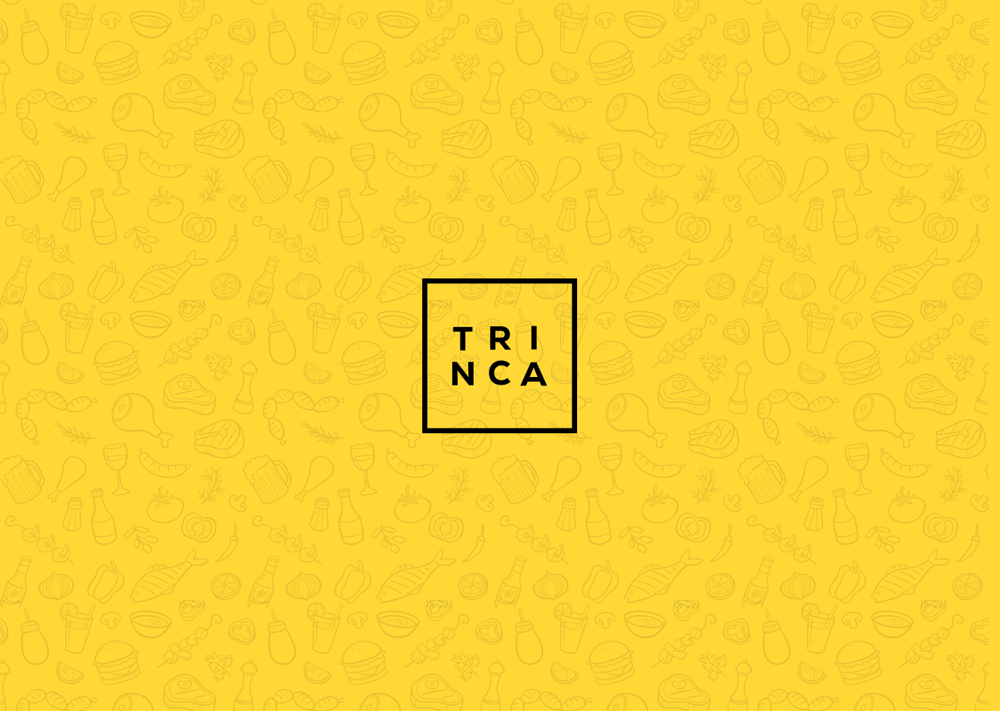

<h1 align="center">Agenda de Churras<h1/>



## Descrição:
Com os altos churrascos que a Trinca faz, alguns até mesmo sem justificativa e em dias aleatórios, propomos uma solução para podermos gerenciar esses churrascos.

## Requisitos:
- Incluir um novo churrasco com data, descrição e observações adicionais;

- Adicionar e remover participantes (colocando o seu valor de contribuição);

- Colocar um valor sugerido por usuário de contribuição (valor com e sem bebida inclusa);

- Visualizar os detalhes do churrasco, total de participantes e valor arrecadado;

## Tecnologias
- React
- Stitches (CSS-IN-JS)
- Storybook
- Vitest + Testing-Library

## Pré-requisitos
- Você instalou a versão mais recente do <a href="https://nodejs.org/">Node</a>;
- Tenha o <a href="https://git-scm.com/">GIT</a> instalado em sua máquina;
- Tenha o <a href="https://yarnpkg.com/">Yarn</a> instalado em sua máquina;
- Tenha o <a href="https://code.visualstudio.com/">Visual Studio Code</a> ou outra IDE instalado em sua máquina;


## Instalado a aplicação
```sh
//Clone o repositório
git clone https://github.com/joaotuliojt/churras-trinca

//Acesse o arquivo clonado
cd churras-trinca

//Instale as dependências
yarn install ou yarn

//Rode a aplicação localmente
yarn dev

//Clique no link que surgir em seu terminal
```

## Links
- Figma: https://www.figma.com/file/xIi1BspCEtaH0hGEp39XQL/Trinca-%7C-Churras?node-id=1%3A1780&t=6nBShmKLFG2kYrBs-1
- Preview: TODO

___
<p align="center">
  
<p/>
<p align="center"> Solução por <a href="https://joaotul.io">joaotul.io</a></p>
